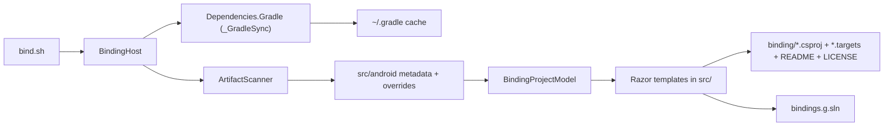

# Architecture

This repo has one job: resolve a selected Android Mapbox Maven graph, map it into `.NET` binding projects, and pack that graph into NuGet packages.

## Flow

## Entry Points

### `bind.sh`

`bind.sh` is the only supported top-level entrypoint for regeneration.

It does three things:

1. Extract the requested `group:artifact:version`.
2. Export the MSBuild inputs that `BindingHost` uses to run `Dependencies.Gradle`.
3. Run `BindingHost`.

The old `build.cake` temp-props step is gone.

### `src/libs/BindingHost`

`BindingHost` is the executable host.

It compiles with:

- `BindingArtifact`
- `BindingSharedPropsPath`
- `BindingGroupPropsPath`
- `BindingArtifactPropsPath`

Those inputs drive the Gradle resolution pass before the Cake tasks run.

## Configuration Layers

Configuration is intentionally split into a few narrow layers.

### Shared repo defaults

- `src/BindingProject.Shared.props`
  Common MSBuild defaults for every generated binding project.
- `src/Mapbox.Shared.props`
  The shared Mapbox Maven repository and namespace replacements.

### Optional local MSBuild overrides

- `src/android/<group>/maven.props`
- `src/android/<group>/<artifact>/maven.props`

These are now optional escape hatches, not the default Mapbox path.

### Artifact metadata

- `src/android/<group>/group.json`
  Group-level metadata and defaults.
- `src/android/<group>/<artifact>/nuget.json`
  NuGet identity and package-level metadata.
- `src/android/<group>/<artifact>/<version>.json`
  Version-level behavior such as fallback and runtime-dependency handling.
- `src/android/<group>/<artifact>/<version>.fixed.json`
  Package-version pins when the resolved graph is wrong.
- `src/android/<group>/<artifact>/<version>.missing.json`
  Extra dependencies that must be surfaced even when the POM graph misses them.

### Binding overrides

- `src/android/<group>/<artifact>/binding/Transforms/Metadata.xml`
- `src/android/<group>/<artifact>/binding/Additions/Additions.cs`

Only keep these files when they contain a real fix.

## Generated Vs Owned Files

Treat the tree like this:

- Edit by hand:
  `src/android/**/*.json`, non-empty `binding/Additions/Additions.cs`, non-empty `binding/Transforms/Metadata.xml`, files under `src/libs`, files under `src/`.
- Generated and safe to overwrite:
  `bindings.g.sln`, `binding/*.csproj`, `binding/*.targets`, `binding/README.md`, `binding/LICENSE`.
- Generated but optional debug output:
  `artifacts.g.json`, `projects.g.json`, `dependency-graph.g.txt`.

## Where Complexity Lives

Most of the repo is data. The real complexity lives in four places:

1. `Dependencies.Gradle`
   Gradle resolution into the local cache.
2. `ArtifactScanner`
   POM and `.module` graph walking plus override application.
3. `src/Project.cshtml`
   The per-artifact project rendering logic.
4. Non-empty `Metadata.xml` and `Additions.cs`
   The hand fixes for bad generated bindings.

If you are debugging behavior, start there rather than reading the whole tree.
